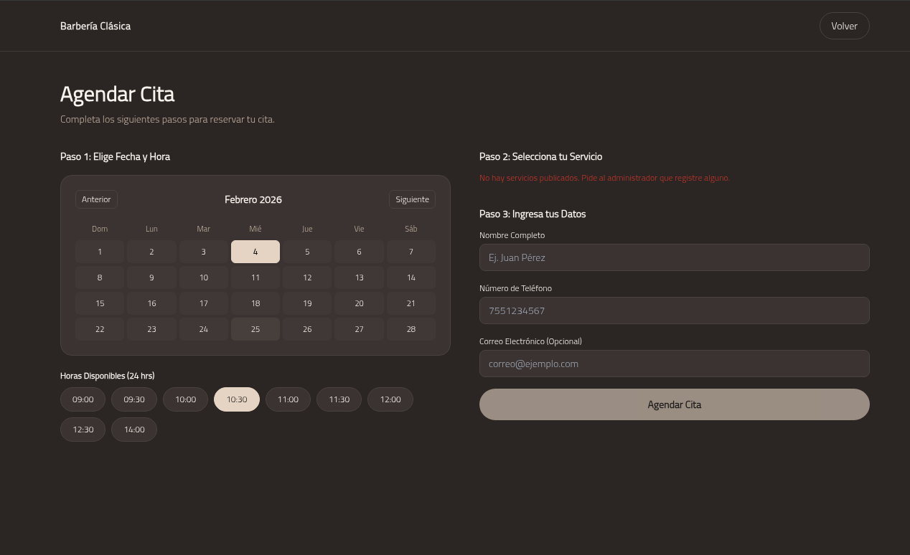

# Barbershop Web System | UX-Driven Fullstack

> **"A clean interface is like a good haircut: it changes how you see the world."**

## The "User-First" Philosophy
Inspired by the immersive menus of story-driven adventure games, I focused on:
* **Visual Hierarchy:** Guiding the eye exactly where it needs to go.
* **Clean Motion:** Built with **React** and **Tailwind CSS** for a snappy, modern feel.
* **Responsive Soul:** Whether you're on a desktop or a phone, the experience remains premium.

## Technical DNA
This project was handcrafted on a **Manjaro Linux** environment, fueled by lo-fi beats and a focus on clean code.

* **Frontend:** React.js (Vite) + Tailwind CSS.
* **Backend:** Node.js & Express.
* **Database:** MongoDB (Cloud Connectivity via Atlas).
* **Tools:** Git, VS Code, and a lot of terminal debugging.

---

## Getting Started

1. **Clone the vibes:**
   `git clone https://github.com/antonio-valdovinos/barbershop-web-system.git`

2. **Backend Setup:**
   `cd backend && npm install && npm run dev`

3. **Frontend Setup:**
   `cd frontend && npm install && npm run dev`

*Don't forget to set up your `.env` for the MongoDB connection!*

---

[LinkedIn](https://linkedin.com/in/antonio-valdovinos) | [Portfolio](https://antoniovaldovinos.dev) | [Email](mailto:antoniovaldovinos.dev@gmail.com)

## 🖼️ Interface Preview

| Landing Page | Appointments Management |
| :---: | :---: |
|  |  |

> **Design Insight:** Visual hierarchy and accessibility were prioritized to ensure a seamless and aesthetic user experience.
